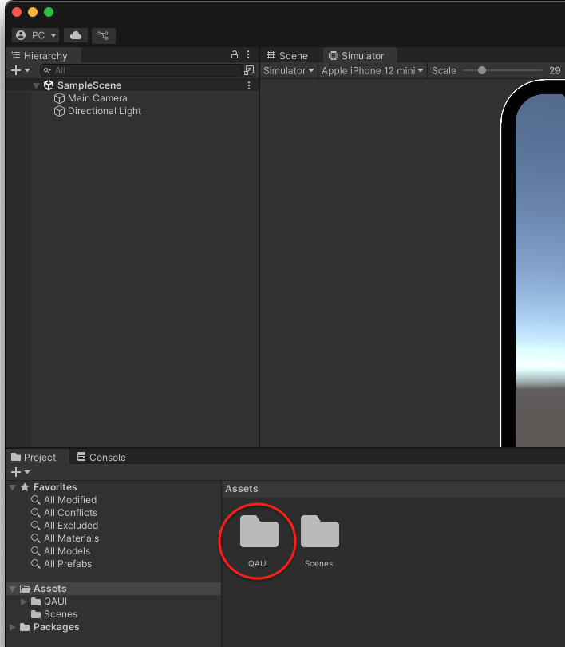

# QAUI

## Unity Code-based UI SDK

A lightweight SDK to help you build code-driven UI in Unity easily and consistently.
No more manually assembling UI components in the Editor for every QA app — define your UI fully in C#, keep it modular, and stay productive.

## Why?

When developing QA apps in Unity, it’s common to repeatedly build the same UI setups (Button, Text Input Field, Checkbox etc.) using the Editor.
This SDK allows you to create those UIs **programmatically**, reducing repetitive work and improving maintainability.

## 🚀 Getting Started

### 1️⃣ Install

Place the `Assets/QAUI` folder under the **Assets** directory of your Unity project.

|  |
| -- |

### 2️⃣ Scene Setup

1. In the Unity top toolbar, click `QAUI` > `Add Scene In Build` to add the scene to the build settings.

2.	Navigate to the location where you want to save the **QAUI.Scene** script, right-click, and select `Create` > `QAUI` > `Scene` to generate the **MainScene** script.

    |  |
    | -- |

3. In the Unity top toolbar, click `QAUI` > `Select Main Scene` to register the newly created **MainScene**.

    |  |
    | -- |

## 🎬 Scene

### Working with the AppBar

|  |
| -- |

The top app bar provides a consistent place along the top of your app window. It contains:

- `Back Button` : Navigates to the previous screen.
- `Title` : Displays the current page or section name. Keep it short and descriptive.
- `Home Button` : Returns directly to the main scene, skipping intermediate pages.

You can set the app bar **title** programmatically when creating your Scene:

```c#
using QAUI;

public class MainScene : Scene
{
    // Set title
    public override string Title() => "Main";

    ...
}
```

### Navigation

You can navigate to another Scene programmatically using the `SceneNavigation.StartScene<T>()` method:

```c#
UIButton.Create(content)
    .SetText(it => { it.SetText("Other Scene"); })
    .SetIcon()

    // Navigate to OtherScene when button is clicked
    .SetOnClickListener(SceneNavigation.StartScene<OtherScene>);
```

### Drawing the UI

In QAUI, the default layout pattern is to place all UI elements inside a **Vertical ScrollView**.
This approach ensures that your UI can adapt to varying screen sizes and allows users to scroll through content that doesn’t fit on a single screen.

```c#
using QAUI;
using UnityEngine;

public class MainScene : Scene
{
    ...

    public override void Initialize(GameObject content)
    {
        UIButton.Create(content)
            .SetText(it => { it.SetText("Other Scene"); })
            .SetIcon()
            .SetOnClickListener(SceneNavigation.StartScene<OtherScene>);

        // Add other UI components below
    }
}
```

## 💬 Dialog

|  |  |
| -- | -- |

Navigate to the location where you want to save the **QAUI.IDialog** script, right-click, and select `Create` > `QAUI` > `Dialog` to generate the Dialog script.


To display the dialog, call `ShowDialog()`. It will remain visible until the user clicks the overlay or you programmatically call `CloseDialog()`.

You can customize the dialog by adding additional UI components inside the `Initialize` function.

## 🛠️ Components
- `UIButton`
- `UICheckBox`
- `UIDropdown`
- `UIHorizontalLayout`
- `UIImage`
- `UIInputField`
- `UIScrollbar`
- `UIScrollView`
- `UISeparator`
- `UISpacer`
- `UISwitch`
- `UIText`
- `UIVerticalLayout`
